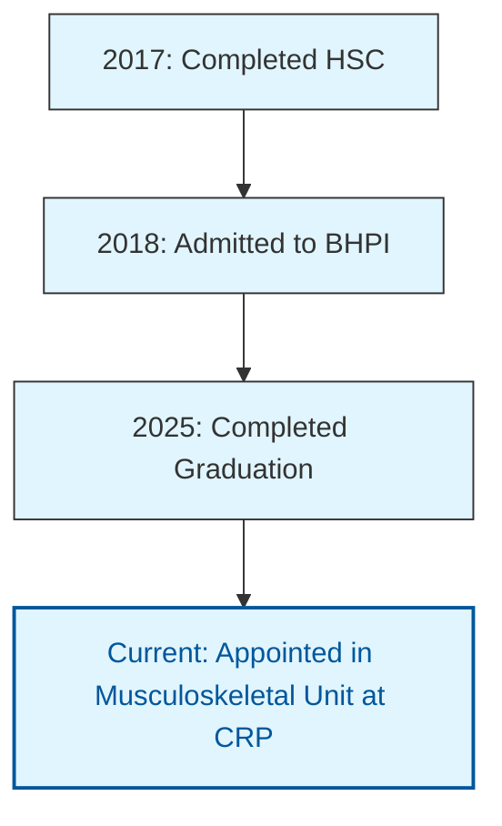

I am a **Physiotherapist and Research Associate** passionate about evidence-based rehabilitation, functional recovery, and patient-centered care.  
Currently serving at **CRP, Savar**, within the *Musculoskeletal Unit* while engaging in **research on circuit training and stroke rehabilitation**.  
I am driven by curiosity, creativity, and compassion in integrating clinical insight with analytical thinking.
---
## **Core Expertise**
- **Physiotherapy & Rehabilitation:** Musculoskeletal, Neurological, Pediatric, and Spinal Cord Injury management  
- **Research & Data Analysis:** Study design, data collection, R, SPSS  
- **Academic Writing & Publication:** Manuscript preparation, journal submission, reference formatting
  

## **Technical & Creative Skills**
- **Programming & Analysis:** R, SPSS, Excel
- **Documentation & Productivity:** Microsoft Word, PowerPoint
- **Design & Visualization:** Adobe Illustrator, Canva
- **Languages:** Bangla (Native), English (Professional)

---

## **Professional Experience**
**Clinical Physiotherapist**  
*Centre for the Rehabilitation of the Paralysed (CRP), Savar*  
_July 2025 – Present_  
- Provide physiotherapy and design rehabilitation plans for diverse patient groups  
- Collaborate with interdisciplinary teams to ensure optimal care outcomes  
- Participate in clinical research and professional workshops
  
## **Intern Physiotherapist**  
*CRP, Savar*  
_March 2024 – February 2025_  
- Completed rotations in Musculoskeletal, Neurology, Pediatric, and SCI Units  
- Final Evaluation: **Excellent**

---

## **Research & Publications**
1. **Sharmin, F., Hossain, M.F., Bari, M.U. et al.** (2025)  
   *Impact of lifestyle factors on depression, anxiety, and functional recovery in ischemic stroke survivors in Bangladesh.*  
   _Discover Public Health_, 22, 616.
   [DOI: 10.1186/s12982-025-01018-2](https://doi.org/10.1186/s12982-025-01018-2)
3. **Sharmin, F., Hossain, M.F., Bari, M.U. et al.** (2025)  
   *Effectiveness of task-oriented circuit training on the motor performance of ischemic stroke patients: a study protocol for RCT.*  
   _BMJ Open Sport & Exercise Medicine_, 11(2).  
   [DOI: 10.1136/bmjsem-2025-002604](https://doi.org/10.1136/bmjsem-2025-002604)
   
---

## 🏅 **Volunteer Experience**
- **Sports Physiotherapist**, *Mymensingh 25K Marathon 2024*  
- **Volunteer Physiotherapist**, *CRP Musculoskeletal Department (Jan–Feb 2024)*

---

## 🏅 **Trainings**
- *Spinal Pain Management* — 120 Hours, Prof. Dr Md Anwar Hossain, CRP  
- *Positioning & Early Mobilization after Burn Injury* — Tarek Hussain & Mercy Ama Agtuahene (UK EMT)
    
---

I believe that healthcare excellence stems from compassion backed by science.  
My goal is to contribute to the advancement of **rehabilitation medicine** in Bangladesh and beyond through **research, education, and clinical innovation**.

---

---
<h1>Career Timeline </h1>

  
  

    <h4 style="margin: 0; color: #01579b; font-size: 1.2em;">2017</h4>
    
Completed HSC

  

  

    <h4 style="margin: 0; color: #01579b; font-size: 1.2em;">2018</h4>
    
Admitted to BHPI

  

  

    <h4 style="margin: 0; color: #01579b; font-size: 1.2em;">2025</h4>
    
Completed Graduation

  

  

    <h4 style="margin: 0; color: #d32f2f; font-size: 1.2em;">Current</h4>
    
Musculoskeletal Unit, CRP

  

  

---

<link rel="stylesheet" href="https://use.fontawesome.com/releases/v6.4.2/css/all.css">
<link rel="preconnect" href="https://fonts.googleapis.com">
<link rel="preconnect" href="https://fonts.gstatic.com" crossorigin>
<link href="https://fonts.googleapis.com/css2?family=Merriweather:ital,wght@0,400;0,700;1,400;1,700&display=swap" rel="stylesheet">

